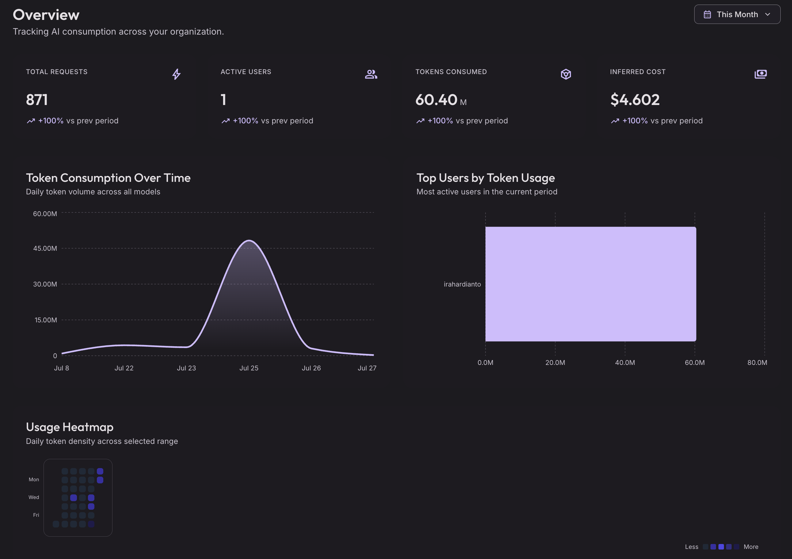
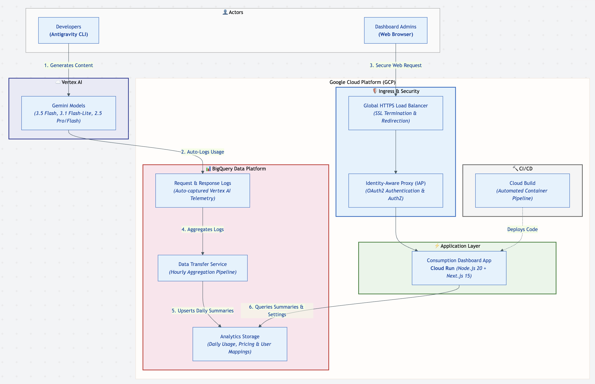

# Antigravity Consumption Dashboard

<div align="center">
  
  <br/>
</div>

An open-source dashboard for tracking Antigravity CLI and Antigravity 2.0 usage per user — with real token counts, cost calculation, and model breakdowns.

## Architecture

- **Next.js 15** — Frontend dashboard with Material Design 3
- **BigQuery** — Usage logs and daily aggregations
- **Cloud Run** — Serverless compute (auto-scaling, zero maintenance)
- **IAP (Identity-Aware Proxy)** — Secure authentication and access control
- **gcloud CLI** — One-command deployment (no Terraform needed)

<div align="center">
  
</div>

## Quick Start

```bash
# 1. Clone the repository
git clone https://github.com/irahardianto/agy-consumption-dashboard.git
cd agy-consumption-dashboard

# 2. Configure
cp config.env.example config.env
nano config.env  # Set PROJECT_ID and AUTHORIZED_MEMBERS

# 3. Deploy (Phase 1 — creates all infrastructure)
bash deploy.sh

# 4. Create IAP OAuth credentials in GCP Console (one-time, ~5 min)
#    Follow the instructions printed by deploy.sh

# 5. Deploy (Phase 2 — paste credentials into config.env, re-run)
bash deploy.sh
```

📖 **Full step-by-step guide:** [docs/deployment-guide.md](docs/deployment-guide.md)

## Prerequisites

- A GCP project with billing enabled
- [Google Cloud SDK](https://cloud.google.com/sdk/docs/install) (`gcloud` CLI)
- Git

## Configuration

Edit `config.env` to customize:

| Setting | Description |
|---------|-------------|
| `PROJECT_ID` | Your GCP project ID |
| `REGION` | GCP region (default: `us-central1`) |
| `AUTHORIZED_MEMBERS` | Users/groups allowed to access the dashboard |
| `GEMINI_MODELS` | Models to track (all GA families included by default) |
| `DOMAIN` | Custom domain for trusted SSL (optional — IP-only works without it) |

See [config.env.example](config.env.example) for all options with documentation.

## IAP Configuration

> **Note:** The IAP OAuth Admin API was shut down in March 2026.
> OAuth credentials must be created manually in GCP Console.

After your first `bash deploy.sh`, the script prints step-by-step instructions.
Full guide: [docs/iap-setup.md](docs/iap-setup.md)

## Development

```bash
cd app
npm install
npm run dev
```

## Uninstall

```bash
bash teardown.sh              # Remove infrastructure, keep BigQuery data
bash teardown.sh --delete-data # Remove everything including data
```

## License

Apache 2.0
