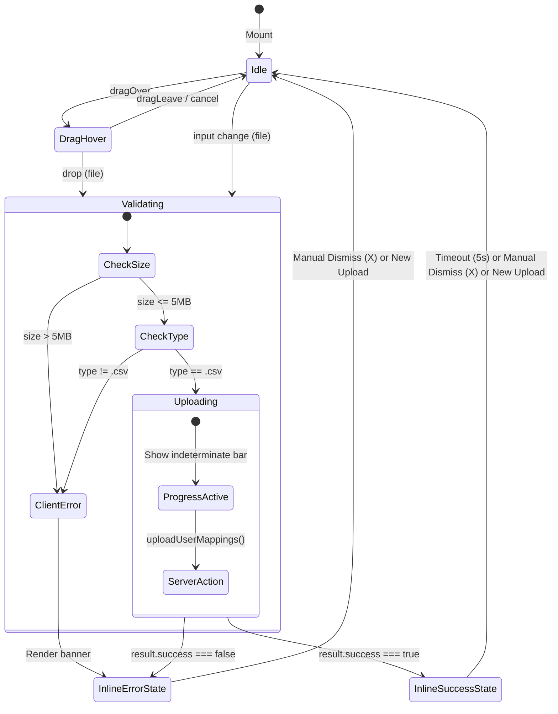

# UX Design Specification: Codebase Audit Remediation
**Document Status:** FROZEN DESIGN CONTRACT  
**Author:** UX Craftsman  
**Date:** 2026-08-16  
**Target Scope:** Audit Remediation (MIN-003, MIN-004, MIN-005)  
**Applicability:** Frontend Builders, Component Developers, Test Automation Engineers  

---

## 1. Executive Summary & Design Principles

This specification defines the visual, interaction, and accessibility contracts for remediating UI audit findings in the AGY Consumption Dashboard:
1. **MIN-005 (Inline Feedback for CSV Upload):** Replace blocking `window.alert()` with an accessible, non-blocking inline feedback banner system supporting success, error, and auto-dismiss lifecycle.
2. **MIN-004 (Client-Side CSV Validation):** Specify immediate client-side size (< 5MB) and MIME/extension type validation feedback in `CsvUploadZone.tsx` before invoking server actions.
3. **MIN-003 (OverviewPage Decomposition):** Provide visual breakdown, card layout contracts, responsive grid specifications, and component hierarchy for decomposing `app/src/app/page.tsx` into modular, single-responsibility components.

---

## 2. Design System Tokens (Frozen Contract)

Builders **MUST** use these exact CSS custom properties and semantic tokens. Do not introduce arbitrary inline styles or hardcoded hex values.

### 2.1 Color Palette & Semantic Tokens

```css
:root {
  /* Surface Layers (Material Design 3 Light / Dark) */
  --md-sys-color-background: light-dark(#FFFBFE, #1C1B1F);
  --md-sys-color-on-background: light-dark(#1C1B1F, #E6E1E5);

  --md-sys-color-surface: light-dark(#FFFBFE, #1C1B1F);
  --md-sys-color-on-surface: light-dark(#1C1B1F, #E6E1E5);
  --md-sys-color-surface-variant: light-dark(#E7E0EB, #49454F);
  --md-sys-color-on-surface-variant: light-dark(#49454F, #CAC4D0);

  --md-sys-color-surface-container-lowest: light-dark(#FFFFFF, #0F0D13);
  --md-sys-color-surface-container-low: light-dark(#F7F2FA, #1D1B20);
  --md-sys-color-surface-container: light-dark(#F3EDF7, #211F26);
  --md-sys-color-surface-container-high: light-dark(#ECE6F0, #2B2930);
  --md-sys-color-surface-container-highest: light-dark(#E6E0E9, #36343B);

  /* Primary Brand (Indigo / Violet) */
  --md-sys-color-primary: light-dark(#6750A4, #D0BCFF);
  --md-sys-color-on-primary: light-dark(#FFFFFF, #381E72);
  --md-sys-color-primary-container: light-dark(#EADDFF, #4F378B);
  --md-sys-color-on-primary-container: light-dark(#21005D, #EADDFF);

  /* Outlines & Borders */
  --md-sys-color-outline: light-dark(#79747E, #938F99);
  --md-sys-color-outline-variant: light-dark(#CAC4D0, #49454F);

  /* Semantic Feedback: Success */
  --feedback-success-bg: light-dark(#E8F5E9, #142817);
  --feedback-success-border: light-dark(#A5D6A7, #2E7D32);
  --feedback-success-text: light-dark(#1B5E20, #C8E6C9);
  --feedback-success-icon: light-dark(#2E7D32, #81C784);
  --feedback-success-badge-bg: light-dark(#C8E6C9, #1B4D20);
  --feedback-success-badge-text: light-dark(#1B5E20, #E8F5E9);

  /* Semantic Feedback: Error */
  --feedback-error-bg: light-dark(#FDECEA, #2C1414);
  --feedback-error-border: light-dark(#F5C6CB, #8C1D18);
  --feedback-error-text: light-dark(#B3261E, #F2B8B5);
  --feedback-error-icon: light-dark(#D32F2F, #E57373);

  /* Semantic Feedback: Warning / Info */
  --feedback-warning-bg: light-dark(#FFF8E1, #2B2105);
  --feedback-warning-border: light-dark(#FFE082, #FFB300);
  --feedback-warning-text: light-dark(#8D6E00, #FFE082);

  /* Upload Dropzone Tokens */
  --upload-zone-border: var(--md-sys-color-outline);
  --upload-zone-border-hover: var(--md-sys-color-primary);
  --upload-zone-border-error: var(--feedback-error-icon);
  --upload-zone-bg: var(--md-sys-color-surface);
  --upload-zone-bg-hover: var(--md-sys-color-surface-container-lowest);
  --upload-zone-bg-active: var(--md-sys-color-surface-container);
  --upload-zone-bg-error: var(--feedback-error-bg);
}
```

### 2.2 Typography Scale

| Token / Role | Font Family | Size | Weight | Line Height | Tracking | Usage |
|---|---|---|---|---|---|---|
| `display-large` | 'Outfit', sans-serif | 57px | 400 | 64px | -0.25px | Hero banners |
| `headline-medium` | 'Outfit', sans-serif | 28px | 600 | 36px | 0px | Page title ("Overview") |
| `title-large` | 'Outfit', sans-serif | 22px | 600 | 28px | 0px | Section headers, Card titles |
| `title-medium` | 'Outfit', sans-serif | 18px | 600 | 24px | 0.15px | Sub-card headers |
| `body-large` | 'Inter', sans-serif | 16px | 400 | 24px | 0.5px | Primary body text |
| `body-medium` | 'Inter', sans-serif | 14px | 400 | 20px | 0.25px | Subtitles, banner messages |
| `body-small` | 'Inter', sans-serif | 13px | 400 | 18px | 0.2px | Metadata, breakdown list items |
| `label-medium` | 'Inter', sans-serif | 12px | 600 | 16px | 0.5px | KPI labels (uppercase), badges |
| `label-small` | 'Inter', sans-serif | 11px | 500 | 14px | 0.4px | Timestamps, secondary hints |
| `code-caption` | monospace | 12px | 500 | 16px | 0px | File formats, usernames |

### 2.3 Spacing & Shape Tokens

- **Spacing Base Unit:** 4px
  - `--space-xxs: 4px`
  - `--space-xs: 8px`
  - `--space-sm: 12px`
  - `--space-md: 16px`
  - `--space-lg: 24px`
  - `--space-xl: 32px`
  - `--space-xxl: 48px`
- **Corner Radii:**
  - `--radius-xs: 4px` (Tags, badges)
  - `--radius-sm: 8px` (Inputs, banners, buttons)
  - `--radius-md: 12px` (Upload zone, inner cards)
  - `--radius-lg: 16px` (Main dashboard cards, modals)
  - `--radius-full: 9999px` (Pill buttons, chips)
- **Elevations (Box Shadow):**
  - `--elevation-1: 0px 1px 3px 1px rgba(0, 0, 0, 0.12), 0px 1px 2px 0px rgba(0, 0, 0, 0.24)`
  - `--elevation-2: 0px 2px 6px 2px rgba(0, 0, 0, 0.12), 0px 1px 2px 0px rgba(0, 0, 0, 0.24)`
  - `--elevation-3: 0px 4px 12px 3px rgba(0, 0, 0, 0.15), 0px 1px 3px 0px rgba(0, 0, 0, 0.30)`

---

## 3. Specification 1: Inline Feedback System for CsvUploadZone (MIN-005)

### 3.1 UX Problem & Goals
- **Current Behavior:** `alert('Successfully uploaded X mappings.')` triggers a modal browser dialog that halts all JS thread execution, provides no branding, lacks screen-reader context, and cannot be styled.
- **Target Experience:** An integrated, animated inline alert banner that mounts smoothly directly beneath the upload dropzone, clearly conveys status with distinct icon + badge + message, provides an explicit dismiss button, and automatically fades after a timed duration.

### 3.2 Component State Flow



### 3.3 Visual Specifications for Inline Feedback Banners

```
+-----------------------------------------------------------------------------------------+
| [✓]  Upload Successful                                                            [✕]   |
|      Successfully imported 42 user identity mappings into BigQuery.                     |
+-----------------------------------------------------------------------------------------+
|                                                                                         |
| [!]  Upload Failed                                                                [✕]   |
|      File exceeds 5MB limit (provided file: 8.4 MB). Please choose a smaller CSV.       |
+-----------------------------------------------------------------------------------------+
```

#### 3.3.1 Success Banner Specification
- **Container:**
  - `margin-top: 12px`
  - `padding: 14px 16px`
  - `background-color: var(--feedback-success-bg)`
  - `border: 1px solid var(--feedback-success-border)`
  - `border-radius: var(--radius-sm, 8px)`
  - `display: flex; align-items: flex-start; gap: 12px; position: relative`
  - `animation: feedbackSlideIn 200ms cubic-bezier(0.2, 0.8, 0.2, 1.0) forwards`
- **Icon:**
  - Symbol: `check_circle` (Material Symbols Outlined)
  - `font-size: 20px`
  - `color: var(--feedback-success-icon)`
  - `flex-shrink: 0; margin-top: 1px`
- **Content Typography:**
  - Title: "Upload Successful" — `font-size: 14px; font-weight: 600; color: var(--feedback-success-text)`
  - Message: "Successfully uploaded `count` user mappings." — `font-size: 13px; font-weight: 400; color: var(--feedback-success-text); margin-top: 2px`
  - Count Badge (optional inline): `background: var(--feedback-success-badge-bg); color: var(--feedback-success-badge-text); font-weight: 700; padding: 1px 6px; border-radius: 4px; font-size: 12px`
- **Dismiss Button:**
  - Icon: `close`
  - `background: transparent; border: none; cursor: pointer; color: var(--feedback-success-text); opacity: 0.7; padding: 4px; border-radius: 4px`
  - Hover: `opacity: 1; background: rgba(0, 0, 0, 0.05)`
  - Focus-visible: `outline: 2px solid var(--feedback-success-icon); outline-offset: 1px`

#### 3.3.2 Error Banner Specification
- **Container:**
  - `margin-top: 12px`
  - `padding: 14px 16px`
  - `background-color: var(--feedback-error-bg)`
  - `border: 1px solid var(--feedback-error-border)`
  - `border-radius: var(--radius-sm, 8px)`
  - `display: flex; align-items: flex-start; gap: 12px; position: relative`
  - `animation: feedbackSlideIn 200ms cubic-bezier(0.2, 0.8, 0.2, 1.0) forwards`
- **Icon:**
  - Symbol: `error` (Material Symbols Outlined)
  - `font-size: 20px`
  - `color: var(--feedback-error-icon)`
  - `flex-shrink: 0; margin-top: 1px`
- **Content Typography:**
  - Title: "Upload Failed" or "Validation Error" — `font-size: 14px; font-weight: 600; color: var(--feedback-error-text)`
  - Message: Specific reason (e.g., "File exceeds 5MB limit", "Only CSV files are accepted", or server error message) — `font-size: 13px; font-weight: 400; color: var(--feedback-error-text); margin-top: 2px`
- **Dismiss Button:**
  - Icon: `close`
  - `color: var(--feedback-error-text)`

### 3.4 Lifecycle & Timing Rules
1. **Auto-Dismiss for Success:** Success banner automatically dismisses after **5000ms (5 seconds)**. If hovered by mouse or focused by keyboard, the timer pauses; it resumes upon mouse-leave or blur.
2. **Persistence for Error:** Error banners **DO NOT** auto-dismiss automatically. Errors require user acknowledgment or dismiss action to prevent missing critical guidance.
3. **Reset on Action:** Whenever the user drags a new file over the zone or selects a new file via file-picker, any existing success or error banners are immediately cleared.

### 3.5 Accessibility (A11y) Mandates
- **Live Regions:**
  - The feedback container element must have `aria-live="polite"` and `role="status"` when rendering a success message.
  - The feedback container element must have `aria-live="assertive"` and `role="alert"` when rendering an error or validation failure.
  - `aria-atomic="true"` on the parent wrapper to ensure screen readers read the full status text.
- **Keyboard Interaction:**
  - The dismiss button must have `aria-label="Dismiss feedback message"`, `tabIndex={0}`, and accessible keyboard focus outline.
  - Triggering `Escape` key inside the component dismisses any active feedback message.
- **Contrast Ratios:**
  - Light mode text contrast: `#1B5E20` on `#E8F5E9` = **7.6:1** (exceeds WCAG AAA).
  - Dark mode text contrast: `#C8E6C9` on `#142817` = **10.2:1** (exceeds WCAG AAA).
  - Error light mode: `#B3261E` on `#FDECEA` = **6.2:1** (exceeds WCAG AA).

---

## 4. Specification 2: Client-Side Validation in CsvUploadZone (MIN-004)

### 4.1 Validation Invariants
Before constructing `FormData` or dispatching `uploadUserMappings()`, `CsvUploadZone` must execute synchronous client-side validation:
1. **File Size Check:**
   - Threshold: `MAX_FILE_SIZE_BYTES = 5 * 1024 * 1024` (5 MB = 5,242,880 bytes).
   - Violation message: `"File exceeds 5MB limit (size: ${(file.size / (1024 * 1024)).toFixed(2)} MB). Please select a smaller CSV file."`
2. **File Extension & MIME Type Check:**
   - Allowed extension: `.csv` (case-insensitive, e.g., `file.name.toLowerCase().endsWith('.csv')`).
   - Allowed MIME types: `text/csv`, `application/vnd.ms-excel`, `text/plain` (some OS/browsers report text/plain for CSVs).
   - Violation message: `"Invalid file type '${file.name.split('.').pop()}'. Only .csv files are supported."`
3. **Empty File Check:**
   - Threshold: `file.size === 0`.
   - Violation message: `"Selected file is empty (0 bytes). Please upload a valid CSV with header and data rows."`

### 4.2 Dropzone Visual Feedback during Validation Failures
- If validation fails:
  - Do **not** transition dropzone to `isUploading` state.
  - Reset `fileInputRef.current.value = ''`.
  - Set `status = { type: 'error', title: 'Invalid File', message: ... }`.
  - Shake animation: trigger a subtle 300ms horizontal shake (`animation: dropzoneErrorShake 300ms ease-in-out`) on the dropzone border.

---

## 5. Specification 3: OverviewPage Component Decomposition (MIN-003)

### 5.1 Architectural Decomposition Matrix

`app/src/app/page.tsx` is broken down from a monolithic 278-line file into structured, single-responsibility components under `app/src/components/overview/` (or `app/src/components/`):

```
app/src/app/page.tsx (Server Page Orchestrator — < 50 lines)
│
├── 1. OverviewHeader.tsx (Client / Server Component)
│      ├── Title: "Overview"
│      ├── Description: "Tracking AI consumption across your organization."
│      └── DateFilter.tsx (Integrated dropdown & date preset picker)
│
├── 2. OverviewKpiGrid.tsx (Server Component)
│      ├── KpiCard: "Total Requests" (bolt icon, trend)
│      ├── KpiCard: "Active Users" (group icon, trend)
│      ├── KpiCard: "Tokens Consumed" (token icon, M unit, trend)
│      └── KpiCard: "Inferred Cost" (payments icon, formatted currency, trend)
│
├── 3. OverviewChartsGrid.tsx (Server / Client Wrapper)
│      ├── ChartCard: "Token Consumption Over Time" -> UsageChart.tsx
│      └── ChartCard: "Top Users by Token Usage" -> UserBarChart.tsx
│
├── 4. OverviewHeatmapSection.tsx (Server / Client Wrapper)
│      └── ChartCard: "Usage Heatmap" -> UsageHeatmap.tsx
│
└── 5. ModelBreakdownCard.tsx (Client / Server Component)
       ├── Header: "Model Breakdown" + Subtitle
       ├── Donut Column: DonutChart.tsx
       └── Progress List Column: Ranked Model Progress Bars & % Share
```

### 5.2 Visual Layout & Grid Contracts

#### 5.2.1 Page Root Container
- `display: flex; flex-direction: column; gap: var(--space-xl, 32px)`
- Max width: 1440px centered with `margin: 0 auto; width: 100%`
- Responsive padding:
  - Desktop (> 1024px): `padding: 0px` (or standard page padding)
  - Tablet (641px - 1024px): `gap: 24px`
  - Mobile (<= 640px): `gap: 20px`

#### 5.2.2 1. OverviewHeader Specification
```
+-----------------------------------------------------------------------------------------+
| Overview                                                      [ Last 3 Days  ▼ ]        |
| Tracking AI consumption across your organization.                                       |
+-----------------------------------------------------------------------------------------+
```
- **Layout:** `display: flex; justify-content: space-between; align-items: flex-start; gap: 16px; flex-wrap: wrap`
- **Title (h2):** `font-family: 'Outfit'; font-size: 28px; font-weight: 600; line-height: 36px; color: var(--md-sys-color-on-background)`
- **Subtitle (p):** `font-family: 'Inter'; font-size: 14px; color: var(--md-sys-color-on-surface-variant); margin-top: 4px`
- **Right Column:** `<DateFilter defaultPreset={defaultPreset} />`

#### 5.2.3 2. OverviewKpiGrid Specification
```
+-------------------+ +-------------------+ +-------------------+ +-------------------+
| TOTAL REQUESTS [⚡]| | ACTIVE USERS   [👥]| | TOKENS CONSUMED[⚪]| | INFERRED COST  [💳]|
| 1,284,520         | | 48                | | 42.15 M           | | $128.45           |
| ↑ +12% vs prev    | | ↑ +4% vs prev     | | ↓ -2% vs prev     | | ↑ +8% vs prev     |
+-------------------+ +-------------------+ +-------------------+ +-------------------+
```
- **Grid Layout:** `display: grid; grid-template-columns: repeat(auto-fit, minmax(200px, 1fr)); gap: 20px`
- **Responsive Breakpoint Behavior:**
  - Desktop (>= 1024px): 4 columns side-by-side.
  - Tablet (641px - 1023px): 2 columns x 2 rows (`grid-template-columns: repeat(2, 1fr)`).
  - Mobile (<= 640px): 1 column stacked (`grid-template-columns: 1fr`).
- **KpiCard Props Contract:**
  ```typescript
  interface OverviewKpiGridProps {
    metrics: OverviewMetrics;
    trends: {
      requestsTrend: TrendResult;
      activeUsersTrend: TrendResult;
      tokensTrend: TrendResult;
      costTrend: TrendResult;
    };
    currency: string;
  }
  ```

#### 5.2.4 3. OverviewChartsGrid Specification
```
+------------------------------------------+ +------------------------------------------+
| Token Consumption Over Time              | | Top Users by Token Usage                 |
| Daily token volume across all models     | | Most active users in the current period  |
| [======================================] | | [======================================] |
| [            (UsageChart)              ] | | [           (UserBarChart)             ] |
+------------------------------------------+ +------------------------------------------+
```
- **Grid Layout:** `display: grid; grid-template-columns: repeat(auto-fit, minmax(min(100%, 480px), 1fr)); gap: 24px`
- **Min Height:** `420px` per card ensuring uniform chart canvas height.
- **Card Styling:** Uses `.card` with `padding: 24px; border-radius: var(--md-sys-shape-corner-large, 16px); background: var(--md-sys-color-surface-container-low)`

#### 5.2.5 4. OverviewHeatmapSection Specification
```
+-----------------------------------------------------------------------------------------+
| Usage Heatmap                                                                           |
| Daily token density across selected range                                               |
| [░░░▒▒▓▓█████████████████████████████████████████████████████████████████████████████]   |
+-----------------------------------------------------------------------------------------+
```
- **Layout:** Full-width container wrapping `ChartCard`.
- **Props:** `startDate: string`, `endDate: string`, `data: UsageOverTimeRow[]`.

#### 5.2.6 5. ModelBreakdownCard Specification (Dedicated Sub-Component)
```
+-----------------------------------------------------------------------------------------+
| Model Breakdown                                                                         |
| Token distribution across Gemini models in the selected period                          |
|                                                                                         |
|         /---------\             gemini-2.5-pro                                          |
|        /   24.5M   \            ======================------------------- 18.2M  74.2%  |
|       |  Total Tok  |                                                                   |
|        \           /            gemini-2.5-flash                                        |
|         \---------/             ========---------------------------------  4.8M  19.5%  |
|                                                                                         |
|       (DonutChart)              gemini-2.5-flash-lite                                   |
|                                 ===--------------------------------------  1.5M   6.3%  |
+-----------------------------------------------------------------------------------------+
```
- **Props Interface:**
  ```typescript
  export interface ModelBreakdownItem {
    model: string;
    tokens: number;
    cost: number;
    percentage: number;
    formattedTokens: string;
  }
  
  export interface ModelBreakdownCardProps {
    breakdown: ModelBreakdownItem[];
    totalTokens: number;
  }
  ```
- **Internal 2-Column Grid:**
  - `display: grid; grid-template-columns: repeat(auto-fit, minmax(280px, 1fr)); gap: 32px; align-items: center`
- **Donut Chart Column:**
  - `display: flex; justify-content: center; align-items: center; min-height: 240px`
- **Progress Bar List Column:**
  - `display: flex; flexDirection: column; gap: 16px`
  - Model Name Item: `font-size: 13px; font-weight: 500; color: var(--md-sys-color-on-surface); text-overflow: ellipsis`
  - Token Volume Label: `font-size: 13px; color: var(--md-sys-color-on-surface-variant)`
  - Percentage Share Badge: `font-size: 13px; font-weight: 600; color: var(--md-sys-color-primary); min-width: 48px; text-align: right`
  - Progress Track: `height: 6px; border-radius: 3px; background-color: var(--md-sys-color-surface-variant); overflow: hidden`
  - Progress Fill: `height: 100%; border-radius: 3px; background: linear-gradient(90deg, var(--md-sys-color-primary), var(--chart-color-1)); transition: width 0.6s cubic-bezier(0.4, 0, 0.2, 1)`

---

## 6. CSS Animations & Micro-Interactions Specification

Add the following animations to `app/src/app/globals.css`:

```css
/* Feedback Banner Slide-In */
@keyframes feedbackSlideIn {
  0% {
    opacity: 0;
    transform: translateY(-6px);
  }
  100% {
    opacity: 1;
    transform: translateY(0);
  }
}

/* Dropzone Error Shake on Validation Failure */
@keyframes dropzoneErrorShake {
  0%, 100% { transform: translateX(0); }
  20%, 60% { transform: translateX(-4px); }
  40%, 80% { transform: translateX(4px); }
}

/* Indeterminate Progress Loading Bar */
@keyframes indeterminate-progress {
  0% {
    left: -35%;
    width: 35%;
  }
  60% {
    left: 100%;
    width: 100%;
  }
  100% {
    left: 100%;
    width: 0%;
  }
}
```

---

## 7. Quality Checklist for Review & Delivery

Before marking remediation as complete, verify:
- [ ] **No `alert()` or `confirm()` in `CsvUploadZone.tsx`** — replaced with inline banner.
- [ ] **Client validation runs before server action** — rejects files > 5MB or non-CSV immediately.
- [ ] **Screen reader accessible** — `aria-live="polite"` on success, `aria-live="assertive"` on error.
- [ ] **`OverviewPage` under 50 lines** — cleanly delegates to `OverviewHeader`, `OverviewKpiGrid`, `OverviewChartsGrid`, `OverviewHeatmapSection`, and `ModelBreakdownCard`.
- [ ] **All color tokens use CSS variables** (`var(--md-sys-...)` / `var(--feedback-...)`).
- [ ] **Light and dark modes render with WCAG AA compliant contrast**.
- [ ] **100% test pass rate** on all unit and component tests.
