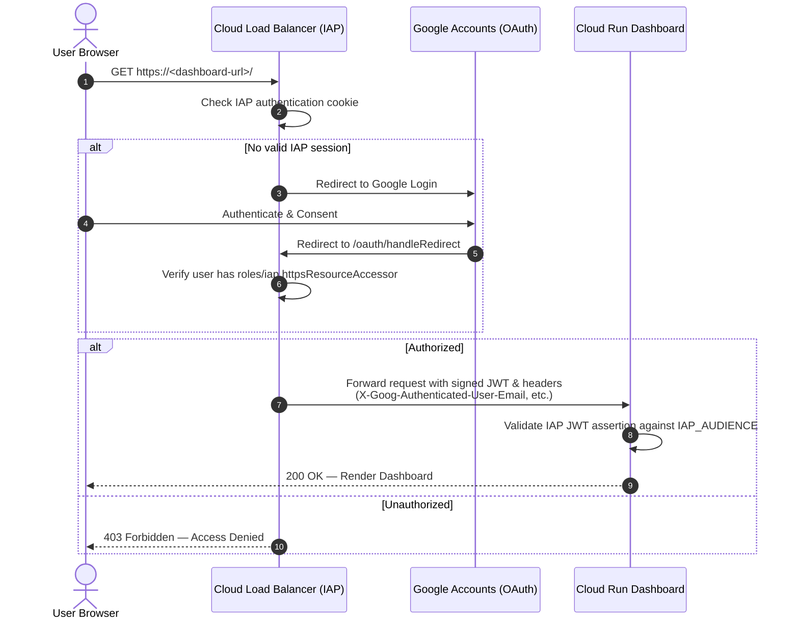

# Identity-Aware Proxy (IAP) Setup Guide

This guide provides step-by-step instructions for configuring **Google Cloud Identity-Aware Proxy (IAP)** to secure access to the Antigravity Consumption Dashboard.

---

## Overview

Identity-Aware Proxy (IAP) intercepts HTTPS requests to the dashboard load balancer, verifies user identities with Google Account authentication, and enforces fine-grained access policies based on IAM roles.

> [!IMPORTANT]
> **Why manual OAuth setup is required**: The programmatic Google Cloud IAP OAuth Admin API was retired in March 2026. OAuth consent screens and Web Client credentials must be created through the Google Cloud Console. This is a one-time configuration per GCP project.

---

## Step-by-Step Setup

### Step 1: Configure OAuth Consent Screen

1. In the Google Cloud Console, navigate to [APIs & Services → OAuth consent screen](https://console.cloud.google.com/apis/credentials/consent) (ensure your target project is selected).
2. Choose the appropriate **User Type**:
   - **Internal**: Recommended if your organization uses Google Workspace / Cloud Identity and only internal employees should access the dashboard.
   - **External**: Required if users with standard `@gmail.com` accounts or multiple Google domains need access.
3. Click **Create** and complete the form:
   - **App name**: `Antigravity Consumption Dashboard`
   - **User support email**: Select your email address or admin group.
   - **App logo**: *(Optional)*
   - **Developer contact information**: Enter your email address.
4. Click **Save and Continue**.
5. **Scopes**: Click **Add or Remove Scopes**. Select standard basic scopes:
   - `.../auth/userinfo.email`
   - `.../auth/userinfo.profile`
   - `openid`
6. Click **Save and Continue**.
7. *(External User Type only)* **Test Users**:
   - If your OAuth Consent Screen is in "Testing" status, add the email addresses of all initial administrators and users who will test the dashboard.
8. Click **Save and Continue** → **Back to Dashboard**.

---

### Step 2: Create OAuth 2.0 Client ID

1. Navigate to [APIs & Services → Credentials](https://console.cloud.google.com/apis/credentials).
2. Click **+ CREATE CREDENTIALS** at the top of the page, then select **OAuth client ID**.
3. Fill in the credential details:
   - **Application type**: Select `Web application`
   - **Name**: `Antigravity Consumption Dashboard`
   - **Authorized JavaScript origins**: *(Leave empty)*
   - **Authorized redirect URIs**: *(Leave empty for now — you will add it in Step 3)*
4. Click **CREATE**.
5. A modal will appear showing your **Client ID** and **Client Secret**. Keep this window open or copy them to a secure location.

---

### Step 3: Add Authorized Redirect URI

Google IAP requires a specific OAuth redirect callback URI tied to your Client ID.

1. In the [Credentials list](https://console.cloud.google.com/apis/credentials), click the edit icon (pencil) next to the OAuth 2.0 Client ID you just created.
2. Under **Authorized redirect URIs**, click **+ ADD URI**.
3. Enter the following URL, replacing `<YOUR_CLIENT_ID>` with the actual Client ID:
   ```
   https://iap.googleapis.com/v1/oauth/clientIds/<YOUR_CLIENT_ID>:handleRedirect
   ```
   *Example:*
   ```
   https://iap.googleapis.com/v1/oauth/clientIds/1234567890-abcdefghijklmnop.apps.googleusercontent.com:handleRedirect
   ```
4. Click **Save**.

---

### Step 4: Update `config.env` and Finalize Deployment

1. Open `config.env` in the root of the project:
   ```bash
   nano config.env
   ```
2. Paste the credentials into `IAP_CLIENT_ID` and `IAP_CLIENT_SECRET`:
   ```bash
   IAP_CLIENT_ID="1234567890-abcdefghijklmnop.apps.googleusercontent.com"
   IAP_CLIENT_SECRET="GOCSPX-xxxxxxxxxxxxxxxxxxxxxxxx"
   ```
3. Ensure `AUTHORIZED_MEMBERS` contains all users and groups who should have access:
   ```bash
   AUTHORIZED_MEMBERS=(
     "user:admin@example.com"
     "user:jane.doe@example.com"
     "group:engineering-leads@example.com"
   )
   ```
4. Re-run the deployment script:
   ```bash
   bash deploy.sh
   ```

The script will re-run Terraform to:
- Enable IAP on the `agy-dashboard-backend` backend service.
- Grant `roles/iap.httpsResourceAccessor` (IAP-secured Web App User) to each member in `AUTHORIZED_MEMBERS`.

---

## How IAP Protects the Dashboard

When a user navigates to the dashboard:



### Injected Context Headers

IAP injects identity headers into forwarded requests to Cloud Run:
- `X-Goog-Authenticated-User-Email`: Format `accounts.google.com:username@example.com`. The application strips the prefix to extract the user's email address for display in the navbar.
- `X-Goog-Iap-Jwt-Assertion`: Cryptographically signed JSON Web Token (JWT) containing user claims, validated by `app/src/lib/auth.ts` against the backend service `IAP_AUDIENCE`.

---

## Managing User Access Post-Deployment

### Option 1: Via `config.env` (Recommended for Infrastructure-as-Code)
1. Add or remove accounts in `AUTHORIZED_MEMBERS` in `config.env`.
2. Run `bash deploy.sh`.

### Option 2: Via Google Cloud Console
1. Navigate to [Security → Identity-Aware Proxy](https://console.cloud.google.com/security/iap).
2. Under **HTTPS Resources**, expand the Backend Services list.
3. Locate `agy-dashboard-backend`.
4. In the right-hand panel, click **Add Principal**.
5. Enter the user or group email and assign the role:
   - **Role**: `Cloud IAP → IAP-secured Web App User` (`roles/iap.httpsResourceAccessor`).
6. Click **Save**.

---

## Troubleshooting IAP Issues

| Symptom | Probable Cause | Resolution |
|---|---|---|
| **Error 400: `redirect_uri_mismatch`** | The redirect URI on the OAuth Client does not match the IAP pattern. | Verify the URI in GCP Credentials is formatted exactly as `https://iap.googleapis.com/v1/oauth/clientIds/<CLIENT_ID>:handleRedirect`. |
| **Error 403: `You don't have access`** | The authenticated user lacks `roles/iap.httpsResourceAccessor`. | Verify the user is listed in `AUTHORIZED_MEMBERS` in `config.env` and re-run `deploy.sh`. |
| **Error 403: `Access blocked: App is in testing`** | OAuth Consent screen is set to External + Testing, and the user is not listed under Test Users. | Add the user's email to **Test Users** on the OAuth consent screen page in GCP Console, or publish the app. |
| **Infinite redirect loop** | Browser cookie blocking or incorrect Load Balancer backend protocol. | Ensure third-party cookies are allowed for `*.google.com`, and verify the backend service protocol is set to `HTTP` with Cloud Run serverless NEG. |
| **Changes to permissions not working immediately** | IAM policy propagation delay. | Wait 60–120 seconds after running `deploy.sh` or modifying IAM policies in the console. |
