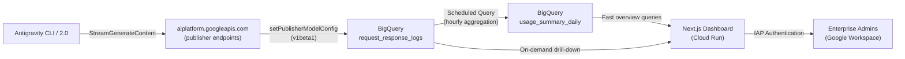

# Antigravity Consumption Dashboard — Implementation Plan

An open-source dashboard for enterprise customers to track Antigravity CLI and Antigravity 2.0 usage per user, with **real token counts** and configurable cost calculation, using Vertex AI request-response logging data in BigQuery.

## Background

Antigravity's enterprise licensing model treats all AI usage as cloud SKUs, which gives organizations no visibility into who is using the tool, how much they're consuming, or what it costs per user. Competitors (Codex, Claude) already offer per-user tracking. This dashboard fills that gap using the `setPublisherModelConfig` API to capture full request-response payloads (including `usageMetadata` with real token counts) directly into BigQuery.

> [!IMPORTANT]
> **We have real token counts.** The `setPublisherModelConfig` API (v1beta1) enables request-response logging on Google-managed publisher models. The `full_response` JSON column in BigQuery contains `usageMetadata` with `promptTokenCount`, `candidatesTokenCount`, `thoughtsTokenCount`, and `totalTokenCount`. No estimation or heuristic needed.

> [!NOTE]
> **Scope**: This dashboard tracks **Antigravity CLI** and **Antigravity 2.0** usage only. These route through `aiplatform.googleapis.com` (Vertex AI) publisher endpoints. We do NOT track the legacy Gemini Code Assist VS Code plugin or Antigravity IDE.

---

## Data Architecture

### Single Data Source: `request_response_logs` in BigQuery



### What Each Row Contains (confirmed from real data)

| Column | Type | What we extract |
|---|---|---|
| `logging_time` | TIMESTAMP | When the call happened |
| `model` | STRING | e.g., `publishers/google/models/gemini-3.5-flash` |
| `api_method` | STRING | `StreamGenerateContent` |
| `full_request` | JSON | **User identity** (from `<user_information>` in system prompt), **trajectory_id** (session), **execution_id** (agent step), model config |
| `full_response` | JSON | **Real token counts**: `promptTokenCount`, `candidatesTokenCount`, `thoughtsTokenCount`, `totalTokenCount` |
| `metadata` | JSON | `request_latency` (ms) |
| `request_id` | NUMERIC | Unique per-request ID |

### User Identity Extraction

Antigravity injects a `<user_information>` block into every conversation's system prompt. The OS home directory path contains the username:

```sql
COALESCE(
  REGEXP_EXTRACT(content, r'/Users/([^/]+)/'),      -- macOS
  REGEXP_EXTRACT(content, r'/home/([^/]+)/'),        -- Linux
  REGEXP_EXTRACT(content, r'C:\\\\Users\\\\([^\\\\]+)\\\\')  -- Windows
) AS os_username
```

> [!NOTE]
> The extracted identity is an **OS username**, not a corporate email. The dashboard Settings page provides two mechanisms for admins to map these to corporate identities: (1) manual editing in a configuration table, and (2) bulk CSV upload for mapping hundreds of users at once.

### Sub-Agent Call Attribution

Some Gemini calls are made by Antigravity sub-agents (e.g., `gemini-3.1-flash-lite` routing calls) that don't carry `<user_information>`. These are attributed to users via:

1. **`trajectory_id` match**: Sub-agent calls sharing the same `trajectory_id` as a parent call are attributed to the parent's user.
2. **Proportional distribution**: Remaining calls with `trajectory_id = null` are distributed proportionally across active users in the same time window, since these represent internal Antigravity routing overhead that is a real part of each user's usage.

---

## Proposed Changes

### Terraform Infrastructure

All GCP resources provisioned via a single Terraform module. Users fill in `terraform.tfvars` and run `terraform apply`.

#### [NEW] [main.tf](file:///Users/irahardianto/works/agy-consumption-dashboard/terraform/main.tf)

Provisions:
- **Google Cloud APIs**: Enable `aiplatform.googleapis.com`, `bigquery.googleapis.com`, `run.googleapis.com`, `iap.googleapis.com`
- **BigQuery dataset**: `agy_consumption` dataset in the user's project
- **Request-Response Logging**: `terraform_data` resource with `local-exec` provisioner calling `setPublisherModelConfig` API (v1beta1) for each model in `var.gemini_models`. This enables logging of full request/response payloads to the BigQuery dataset.

```hcl
resource "terraform_data" "enable_rr_logging" {
  for_each = toset(var.gemini_models)

  triggers_replace = {
    model   = each.key
    project = var.project_id
    dataset = google_bigquery_dataset.agy_consumption.dataset_id
  }

  provisioner "local-exec" {
    command = <<-EOT
      curl -s -X POST \
        -H "Authorization: Bearer $(gcloud auth application-default print-access-token)" \
        -H "Content-Type: application/json" \
        "https://aiplatform.googleapis.com/v1beta1/projects/${var.project_id}/locations/global/publishers/google/models/${each.key}:setPublisherModelConfig" \
        -d '{
          "publisherModelConfig": {
            "loggingConfig": {
              "enabled": true,
              "samplingRate": 1.0,
              "bigqueryDestination": {
                "outputUri": "bq://${var.project_id}.${google_bigquery_dataset.agy_consumption.dataset_id}.request_response_logs"
              }
            }
          }
        }'
    EOT
  }
}
```

- **BigQuery scheduled queries**: Hourly aggregation into `usage_summary_daily` materialized table (using `google_bigquery_data_transfer_config` with `scheduled_query`)
- **BigQuery config tables**: `dashboard_settings` (pricing), `user_mappings` (OS username → corporate identity)
- **Cloud Run service**: Deploys the Next.js dashboard container with `iap_enabled = true`
- **IAP IAM bindings**: Authorized users/groups for dashboard access
- **Service account**: For Cloud Run → BigQuery access (`roles/bigquery.dataViewer`, `roles/bigquery.jobUser`)
- **Artifact Registry**: Repository for storing the dashboard container image

#### [NEW] [variables.tf](file:///Users/irahardianto/works/agy-consumption-dashboard/terraform/variables.tf)

Required variables:
- `project_id` — GCP project ID
- `region` — GCP region (default: `us-central1`)
- `authorized_members` — List of IAP-authorized users/groups

Optional variables:
- `dataset_id` — BigQuery dataset name (default: `agy_consumption`)
- `gemini_models` — List of Gemini models to enable logging for (default: `["gemini-3.6-flash", "gemini-3.5-flash", "gemini-3.1-pro-preview", "gemini-3-flash-preview"]`)
- `cloud_run_cpu` / `cloud_run_memory` — Resource limits

#### [NEW] [outputs.tf](file:///Users/irahardianto/works/agy-consumption-dashboard/terraform/outputs.tf)

Outputs: Dashboard URL, BigQuery dataset ID, service account email.

#### [NEW] [terraform.tfvars.example](file:///Users/irahardianto/works/agy-consumption-dashboard/terraform/terraform.tfvars.example)

Example configuration with comments explaining each variable.

---

### BigQuery Data Pipeline

#### Scheduled Aggregation Query (Terraform-managed)

Runs hourly (at `:05` past the hour to avoid duplication):

```sql
MERGE INTO `usage_summary_daily` T
USING (
  WITH user_sessions AS (
    -- Step 1: Extract user from calls that have <user_information>
    SELECT DISTINCT
      JSON_EXTRACT_SCALAR(full_request, '$.labels.trajectory_id') AS trajectory_id,
      COALESCE(
        REGEXP_EXTRACT(JSON_EXTRACT_SCALAR(full_request, '$.contents[0].parts[0].text'), r'/Users/([^/]+)/'),
        REGEXP_EXTRACT(JSON_EXTRACT_SCALAR(full_request, '$.contents[0].parts[0].text'), r'/home/([^/]+)/')
      ) AS os_username
    FROM `request_response_logs`
    WHERE COALESCE(
      REGEXP_EXTRACT(...), REGEXP_EXTRACT(...)
    ) IS NOT NULL
  ),
  attributed AS (
    -- Step 2: Join all calls with user sessions
    SELECT
      DATE(r.logging_time) AS day,
      COALESCE(
        -- Direct username from this row
        COALESCE(
          REGEXP_EXTRACT(JSON_EXTRACT_SCALAR(r.full_request, '$.contents[0].parts[0].text'), r'/Users/([^/]+)/'),
          REGEXP_EXTRACT(JSON_EXTRACT_SCALAR(r.full_request, '$.contents[0].parts[0].text'), r'/home/([^/]+)/')
        ),
        -- Or from parent session via trajectory_id
        su.os_username
      ) AS os_username,
      REGEXP_EXTRACT(r.model, r'models/(.+)') AS model,
      CAST(JSON_EXTRACT_SCALAR(r.full_response, '$.usageMetadata.promptTokenCount') AS INT64) AS input_tokens,
      CAST(JSON_EXTRACT_SCALAR(r.full_response, '$.usageMetadata.candidatesTokenCount') AS INT64) AS output_tokens,
      CAST(JSON_EXTRACT_SCALAR(r.full_response, '$.usageMetadata.thoughtsTokenCount') AS INT64) AS thinking_tokens,
      CAST(JSON_EXTRACT_SCALAR(r.full_response, '$.usageMetadata.totalTokenCount') AS INT64) AS total_tokens,
      CAST(JSON_EXTRACT_SCALAR(r.metadata, '$.request_latency') AS FLOAT64) AS latency_ms
    FROM `request_response_logs` r
    LEFT JOIN user_sessions su
      ON JSON_EXTRACT_SCALAR(r.full_request, '$.labels.trajectory_id') = su.trajectory_id
  )
  SELECT
    day,
    COALESCE(os_username, '__unattributed__') AS os_username,
    model,
    COUNT(*) AS request_count,
    SUM(input_tokens) AS input_tokens,
    SUM(output_tokens) AS output_tokens,
    SUM(thinking_tokens) AS thinking_tokens,
    SUM(total_tokens) AS total_tokens,
    COUNT(DISTINCT JSON_EXTRACT_SCALAR(full_request, '$.labels.trajectory_id')) AS sessions,
    AVG(latency_ms) AS avg_latency_ms
  FROM attributed
  GROUP BY 1, 2, 3
) S
ON T.day = S.day AND T.os_username = S.os_username AND T.model = S.model
WHEN MATCHED THEN UPDATE SET ...
WHEN NOT MATCHED THEN INSERT ...
```

Unattributed calls (`__unattributed__`) are redistributed proportionally in the dashboard application layer when rendering.

---

### Next.js Dashboard Application

A production-grade Next.js 15 (App Router) application with Material Design 3 theming.

#### [REMOVED] Dockerfile
Docker is not used in this project. Deployment is handled via Cloud Run source-based deployment using `@google-cloud/buildpacks`.

#### [NEW] Source-based Deployment
The application is deployed using the following command:
```bash
gcloud run deploy agy-dashboard --source . --region us-central1
```
This command uses Google Cloud Buildpacks to automatically detect the Next.js environment, build the production bundle, and deploy it to Cloud Run.


#### [NEW] [package.json](file:///Users/irahardianto/works/agy-consumption-dashboard/app/package.json)

Dependencies:
- `next` (v15) — Framework
- `react`, `react-dom` (v19) — UI
- `@google-cloud/bigquery` — BigQuery client
- `recharts` — Charting library
- `date-fns` — Date utilities
- `csv-parse` — CSV parsing for user mapping upload

> [!NOTE]
> No `gpt-tokenizer` — we use real token counts from `usageMetadata`.

#### [NEW] [src/app/layout.tsx](file:///Users/irahardianto/works/agy-consumption-dashboard/app/src/app/layout.tsx)

Root layout with Material Design 3 theming:
- CSS custom properties for MD3 color system (primary, surface, on-surface, etc.)
- Dynamic color theming with light/dark mode toggle
- Google Sans / Inter font loading
- Global navigation header with app title, user email (from IAP header), and theme toggle

#### [NEW] [src/app/page.tsx](file:///Users/irahardianto/works/agy-consumption-dashboard/app/src/app/page.tsx) — Overview Dashboard

Server Component reading from `usage_summary_daily`:

**KPI Cards** (top row):
- Total requests (last 30 days)
- Unique active users
- Total tokens consumed (real count)
- Total inferred cost (tokens × configured pricing)

**Charts**:
- Usage over time — Area chart (daily token volume, stacked by model)
- Top users — Horizontal bar chart (top 10 users by total tokens)
- Model distribution — Donut chart (% of tokens by Gemini model variant)
- Usage heatmap — GitHub-style contribution grid (requests per day per user)

#### [NEW] [src/app/users/page.tsx](file:///Users/irahardianto/works/agy-consumption-dashboard/app/src/app/users/page.tsx) — User Breakdown

Sortable table with:
- Display name (from user mapping) or OS username
- Total requests
- Input tokens / Output tokens / Thinking tokens
- Inferred cost
- Last active timestamp
- Sparkline trend (last 30 days)

Click a user → drill-down page.

#### [NEW] [src/app/users/[username]/page.tsx](file:///Users/irahardianto/works/agy-consumption-dashboard/app/src/app/users/[username]/page.tsx) — User Detail

On-demand BigQuery queries for:
- User's request timeline
- Token consumption trend
- Model usage breakdown
- Per-session breakdown (grouped by `trajectory_id`)

#### [NEW] [src/app/methodology/page.tsx](file:///Users/irahardianto/works/agy-consumption-dashboard/app/src/app/methodology/page.tsx) — Methodology

Transparency page explaining how the dashboard works:

1. **Data source** — Explains the `setPublisherModelConfig` API and what `request_response_logs` captures
2. **Token counts** — Explains that these are **real counts** from `usageMetadata` (not estimates), including:
   - `promptTokenCount` (input)
   - `candidatesTokenCount` (output)
   - `thoughtsTokenCount` (thinking/reasoning)
   - `totalTokenCount`
3. **Cost calculation** — Formula: `(input_tokens × input_price) + (output_tokens × output_price)` per model. Links to Settings page for pricing config. Notes that costs are "inferred" from token counts × configured pricing and may differ from actual Cloud Billing.
4. **User identification** — How OS usernames are extracted from the Antigravity system prompt, and how admins can map them to corporate identities
5. **Sub-agent attribution** — How sub-agent calls (Antigravity's internal multi-agent calls) are attributed to the user who initiated the parent session via `trajectory_id`. Calls without a `trajectory_id` are distributed proportionally across active users, as they represent internal routing overhead that is part of each user's real usage.
6. **Limitations** — What this dashboard does NOT track (legacy Gemini Code Assist plugin, direct Vertex AI API calls not through Antigravity)

#### [NEW] [src/app/settings/page.tsx](file:///Users/irahardianto/works/agy-consumption-dashboard/app/src/app/settings/page.tsx) — Settings

Admin configuration page with three sections:

1. **Pricing configuration** — Editable table of per-model pricing:
   - Columns: Model name, Input price (per 1M tokens), Output price (per 1M tokens)
   - Pre-populated with published Gemini pricing
   - "Reset to defaults" button
   - Source link to [Google's official pricing page](https://cloud.google.com/vertex-ai/generative-ai/pricing)
   - Saved to `dashboard_settings` BigQuery table

2. **User mapping** — Map OS usernames to corporate display names/emails:
   - Editable table: OS username → Display name → Email
   - **CSV upload**: Drag-and-drop or file picker for bulk upload. CSV format: `os_username,display_name,email`
   - Download current mappings as CSV
   - Saved to `user_mappings` BigQuery table

3. **Dashboard preferences** — Default date range, refresh interval, currency display

#### [NEW] [src/lib/bigquery.ts](file:///Users/irahardianto/works/agy-consumption-dashboard/app/src/lib/bigquery.ts)

BigQuery client wrapper:
- Singleton BigQuery client (via Workload Identity on Cloud Run)
- Query functions: `getOverviewMetrics()`, `getUsageOverTime()`, `getTopUsers()`, `getUserDetail(username)`, `getModelDistribution()`
- SQL templates with parameterized date ranges and user filters
- Joins `usage_summary_daily` with `user_mappings` to resolve display names

#### [NEW] [src/lib/cost.ts](file:///Users/irahardianto/works/agy-consumption-dashboard/app/src/lib/cost.ts)

Cost calculation:
- `calculateCost(inputTokens, outputTokens, model, pricing): number`
- Default pricing map with published Gemini model prices, overridable from Settings page
- Reads pricing from `dashboard_settings` BigQuery table

#### [NEW] [src/lib/settings.ts](file:///Users/irahardianto/works/agy-consumption-dashboard/app/src/lib/settings.ts)

Settings persistence:
- `getSettings()` / `updatePricing()` / `updatePreferences()` — `dashboard_settings` table
- `getUserMappings()` / `updateUserMappings()` / `uploadUserMappingsCsv()` — `user_mappings` table
- CSV parsing for bulk upload

#### [NEW] [src/lib/auth.ts](file:///Users/irahardianto/works/agy-consumption-dashboard/app/src/lib/auth.ts)

IAP header parser:
- Extracts user email from `X-Goog-Authenticated-User-Email` header
- Validates IAP JWT token (optional, for defense-in-depth)

#### [NEW] [src/components/](file:///Users/irahardianto/works/agy-consumption-dashboard/app/src/components/)

Reusable UI components following Material Design 3:
- `KpiCard` — Metric card with label, value, trend indicator
- `ChartCard` — Card wrapper for recharts visualizations
- `DataTable` — Sortable, paginated table with sparklines
- `DateRangePicker` — Date range selector for filtering
- `NavBar` — Top navigation with links to Overview, Users, Methodology, Settings
- `ThemeProvider` — MD3 dynamic color context
- `PricingTable` — Editable table for per-model pricing configuration
- `UserMappingTable` — Editable table + CSV upload for username→identity mapping
- `CsvUploader` — Drag-and-drop CSV file uploader with preview and validation

#### [NEW] [src/app/globals.css](file:///Users/irahardianto/works/agy-consumption-dashboard/app/src/app/globals.css)

Material Design 3 design system:
- CSS custom properties for the full MD3 color scheme (light + dark)
- Typography scale (display, headline, title, body, label)
- Elevation/shadow tokens
- Shape tokens (rounded corners)
- Motion tokens (easing curves, durations)
- Component styles (cards, buttons, tables, navigation)

---

### Documentation

#### [NEW] [README.md](file:///Users/irahardianto/works/agy-consumption-dashboard/README.md)

Comprehensive README with:
- Problem statement and value proposition
- Architecture diagram (Mermaid)
- Prerequisites (GCP project with Antigravity enabled, Terraform, gcloud CLI)
- Quick start (3 steps: clone, configure, `terraform apply`)
- Configuration reference
- Screenshots
- FAQ (data source, token counts, cost calculation, user identity, privacy)
- Future roadmap (audit log integration for security, Cloud Billing export cross-reference)
- Contributing guide
- License (MIT)

#### [NEW] [LICENSE](file:///Users/irahardianto/works/agy-consumption-dashboard/LICENSE)

MIT License.

---

## Verification Plan

### Automated Tests
```bash
# Lint and type-check the Next.js app
cd app && npm run lint && npm run build

# Terraform validation
cd terraform && terraform init && terraform validate && terraform plan

# Unit tests for cost calculation, user extraction regex, CSV parsing
npm run test
```

### Manual Verification
1. Deploy to `irahardianto-labs` (already has request-response logging enabled)
2. Generate Antigravity CLI/2.0 usage
3. Verify data appears in `agy_consumption.request_response_logs`
4. Verify scheduled query populates `usage_summary_daily`
5. Verify dashboard loads with real data showing usernames, token counts, costs
6. Verify IAP authentication works (only authorized users can access)
7. Test user mapping (manual edit + CSV upload)
8. Test pricing configuration (edit + reset to defaults)
9. Test date range filtering and user drill-down

---

## Future Roadmap (Post-v1)

Items deferred from this implementation:

- **Cloud Audit Log integration** — Add audit log sink for security/compliance features (IP tracking, OAuth client ID, user agent versioning)
- **Cloud Billing export cross-reference** — Compare inferred cost with actual billing data
- **Alerting** — Configurable alerts when user/project token consumption exceeds thresholds
- **Multi-project support** — Aggregate data from multiple GCP projects
- **API key management** — REST API for programmatic access to dashboard data
